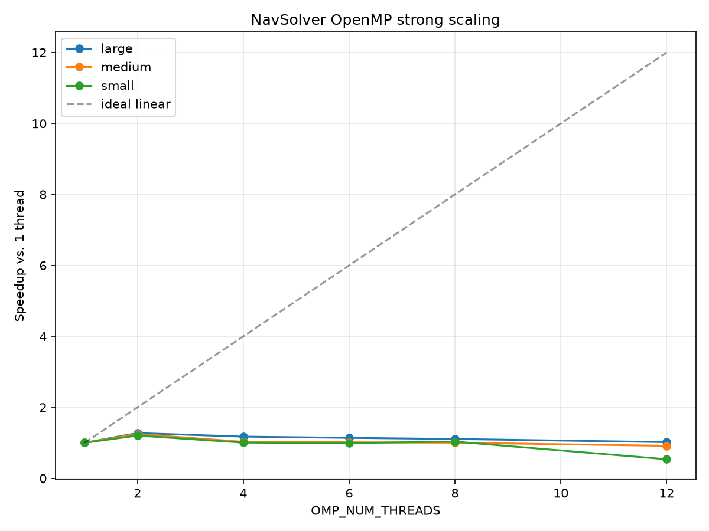

# OpenMP parallelization

**Date:** 2026-08-07 (started)
**Builds on:** `docs/roofline.md`, `docs/serial-optimization-loop-order.md`

## Why red-black first

The serial solver's `solvePressurePoisson` is plain Gauss-Seidel/SOR: each
cell's update reads a neighbor that was just written earlier in the same
sweep — a genuine loop-carried dependency. That can't be correctly
parallelized as-is; naive `#pragma omp parallel for` on it either races
(wrong, non-reproducible results depending on thread scheduling) or has to
serialize (defeating the point).

Red-black splits cells into two colors by `(i+j+k)` parity. Every cell's 6
face-neighbors are always the *other* color, so within one color, no
cell's update depends on another cell of the same color — updating a whole
color is embarrassingly parallel. Built and verified **serially first**
(no `#pragma omp` anywhere yet), deliberately: conflating "did I break the
algorithm" with "did I introduce a race" would make both nearly
undebuggable together, and this is a genuine algorithm change (same fixed
point, different iteration path), not just an engineering refactor.

Also built as shared infrastructure (`src/common/RedBlackIndexing.hpp`),
not OpenMP-specific — the same red/black index lists are the planned
foundation for the CUDA pressure-solve kernels too, so this is built once
rather than re-derived per backend.

## What changed

- `src/common/RedBlackIndexing.hpp` — `buildRedBlackIndices(SimState&)`
  fills `s.redCells`/`s.blackCells` (flat `CellIndex{i,j,k}` lists) for the
  active interior domain, using the identical bounds logic
  `solvePressurePoisson` already used for its `jLoopS`/`jLoopN`
  active-span computation. Built once (lazily, on first
  `solvePressurePoisson` call) and reused for the whole run — geometry is
  fixed after `initSimulation()`.
- `src/openmp/` created as a full copy of `src/serial/` (deliberately
  duplicative, not `#ifdef`-branched into the serial file — lower risk,
  doesn't destabilize the already-verified serial path while editing for
  parallelism; the tradeoff is ~900 duplicated lines, with a noted future
  cleanup once both paths stabilize: extract the unchanged, non-hot
  functions into `src/common/`).
- `solvePressurePoisson` in `src/openmp/Physics.cpp` restructured: the
  serial version's *inline* Neumann ghost-cell mirroring (interleaved
  mid-sweep, using whatever `press(i,j,k)` holds at that point in a single
  continuous traversal) can't survive reordering into red-black — colors
  update out of that original traversal order. Factored into its own
  explicit `mirrorGhostCells()` pass, run **twice per sweep**: once before
  updating RED, once before updating BLACK (BLACK's boundary cells need to
  see RED's just-updated interior values reflected in the ghost layer,
  which a single shared mirror pass wouldn't provide).
- Both build systems wired: `make openmp` → `navsolver_omp`; CMake
  `find_package(OpenMP)` (not `REQUIRED`) guards a `navsolver_omp` target,
  so configure still succeeds on a machine without OpenMP.

## Two real findings while verifying, not glossed over

**1. Pressure has a null space — comparisons must be gauge-fixed.** A
uniform additive offset to the whole pressure field never affects
velocity (only `∇p` matters), so serial and red-black converging to
solutions that differ by such an offset would still be "correct" — but a
naive value-by-value comparison would show a large, misleading gap. Traced
by checking whether subtracting each field's own mean before comparing
closed most of the gap (it did — from ~2% raw down to ~0.1%). `scripts/validate.py`'s
red-black equivalence tier now explicitly gauge-fixes before comparing;
see the module docstring there for the full reasoning.

**2. `AbruptExpansion`'s stepped geometry doesn't fully converge even in
the *serial* (original) solver at very large sweep counts.** Testing the
equivalence check at increasing `numPressureIter` (200 → 3000 → 20000) to
see the gap close instead showed it *growing* (14% → 30% → 42%
gauge-fixed), and critically the **serial** solver's own mean pressure was
still drifting upward at 20000 sweeps (−0.045 → 0.096 → 0.220) — not a
red-black artifact, a property of the original algorithm on this
geometry's stepped boundary at sweep counts far beyond anything real usage
hits (production configs use 5-20 sweeps, never thousands). The simpler
`Straight` geometry (full rectangular domain, no stepped boundary)
converges cleanly and was used for the equivalence test instead — testing
algorithm correctness needs a well-posed case, and this drift is a
separate, pre-existing question about the original solver's long-run
behavior on complex geometry that's out of scope for this parallelization
work. Flagged here so it isn't silently rediscovered later; not
investigated further in this pass.

## Verification so far (before any `#pragma omp`)

- `make test`: 15/15 (unaffected — no `src/openmp` tests yet, this counts
  the existing serial suite staying green through the `SimState.hpp`
  additions shared by both paths).
- `scripts/validate.py`: all three tiers pass, including the new red-black
  equivalence tier (gauge-fixed `L2_rel = 1.15e-3`, well under the `1e-2`
  tolerance).
- The `navsolver_omp` binary (serial red-black, no parallelism yet)
  independently passes the Poiseuille analytical check at machine epsilon
  (`ResidMax ≈ 1.5e-14`) — strong evidence the red-black port is solving
  the actual physics correctly, not just "close to serial."
- AddressSanitizer + UBSan clean across `AbruptExpansion`/`SolidWall` and
  `RoundedCorner`/`Periodic` (exercises both the non-periodic ghost-mirror
  path and the periodic-wrap path in `updateColor`).

## Parallelization

**`computeAccelerations`**: per-thread scratch buffers. The shared
`SimState`-owned buffers from `docs/serial-optimization.md`/
`docs/serial-optimization-loop-order.md` (`ppin`/`ppis`/.../`Ku`/`Kv`/`Kw`,
and the X-sweep's 2-D `ppieXK`/etc.) are a real race hazard once multiple
threads process different planes concurrently — sized `maxThreads ×
scratchLen` (`SimState::allocateFields()`, `maxThreads = 1` in the serial
build via `#ifdef _OPENMP`, identical behavior to before per-thread buffers
existed), each thread's slice padded to a 64-byte (8-double) boundary to
reduce false sharing at slice boundaries. `VM`/`VM2` changed from
`std::vector<double>&` to `double*` so each thread just computes its own
offset pointer once at the top of one `#pragma omp parallel` region
wrapping all three sweeps, with `#pragma omp for schedule(static)` on each
sweep's outer loop (`j` for X, `i` for Y and Z) — `schedule(static)` both
because per-plane cost is fairly uniform for this geometry and because it
makes results deterministic at a fixed thread count, which the
verification below depends on.

**`solvePressurePoisson`**: `#pragma omp parallel for schedule(static)` on
`updateColor`'s per-cell loop (converted from range-based to index-based —
required for OpenMP's canonical loop form).

### A real data race, found and fixed

Initially also parallelized `mirrorGhostCells` (same O(active-cells) cost
as one color's update, called twice per sweep — leaving it serial looked
like a real Amdahl's-law loss) based on an "ownership" argument: each
ghost-cell write seemed attributable to exactly one owning `i`. **That
argument was wrong.** Caught it via a determinism check — running the same
config at a fixed thread count (12) multiple times gave *different*
`DilMax` every run, which cannot happen under `schedule(static)` if the
code is race-free. ThreadSanitizer isn't usable to pinpoint it directly
(same WSL2 limitation as `perf`, see `docs/roofline.md` — TSan fails with
`FATAL: unexpected memory mapping` at startup in this sandbox), so isolated
it by binary search: disable `updateColor`'s pragma only (still
non-deterministic) vs. disable `mirrorGhostCells`'s pragma only (became
deterministic) — confirmed the race was in `mirrorGhostCells`.

Root cause: the `j==jLoopS`/`j==jLoopN` ghost extensions write
`press(i, j∓1, k)` — same row `i` as the writing thread — but a
*different* thread processing `i+1` can also write into row `i` via its
own `im=i` target, whenever `i+1 == s.iLow[j']+1` for some `j'` that
happens to equal this thread's `j∓1` target. Two threads writing the same
address with different source values — exactly the collision the original
"no two `i` values collide" analysis missed (it only checked `im`/`ip`
cross-`i` writes against each other, not against the same-row `j`-shift
writes).

**Fix: left `mirrorGhostCells` serial.** It's cheap relative to
`updateColor`'s actual linear-algebra work, and without TSan available to
formally verify a corrected parallel version, not worth the correctness
risk. Re-verified after the fix: bit-identical `DilMax` across
`OMP_NUM_THREADS ∈ {1,2,4,6,8,12}`, 5 repeats at 12 threads, on two
different geometries (`AbruptExpansion`/`SolidWall` and
`RoundedCorner`/`Periodic`), plus a clean ASan/UBSan pass at 1/6/12 threads
on both.

## Verification

- `make test`: 15/15.
- `scripts/validate.py`: all three tiers pass, including the red-black
  equivalence tier (gauge-fixed `L2_rel = 1.15e-3`).
- `navsolver_omp` independently passes the Poiseuille analytical check at
  machine epsilon (`ResidMax ≈ 1.5e-14`).
- `scripts/validate_parallel.py` (`make validate-parallel`, wired into CI)
  formalizes the manual checks used during debugging into two automated
  tiers: **thread-count equivalence** (every `OMP_NUM_THREADS` compared
  against 1-thread `navsolver_omp`, deliberately *not* against serial
  `navsolver` — red-black only matches serial at high sweep counts, an
  unrelated fact already covered by `scripts/validate.py`'s red-black
  tier; comparing against serial here would conflate two different
  questions) and **determinism** (same config run twice at a fixed thread
  count). Both bit-identical (`L2_rel = 0.0`) across
  `OMP_NUM_THREADS ∈ {1,2,4,6,12}` on both geometries — makes sense in
  retrospect: neither `computeAccelerations` nor `updateColor` do any
  cross-thread reduction (each cell is written by exactly one thread), so
  there's no floating-point reordering source to begin with, unlike a
  typical OpenMP reduction pattern.
- AddressSanitizer + UBSan clean at 1/6/12 threads on both geometries.
- `mirrorGhostCells` remaining serial is a known, documented limitation —
  a correct parallel version is possible in principle (the race is a
  specific, understood collision pattern, not a fundamental one) but
  wasn't attempted further given no TSan to verify it in this environment.

## Performance: strong scaling is poor, and the roofline predicted why

`scripts/benchmark.py --binary navsolver_omp --threads 1,2,4,6,8,12`
(`AbruptExpansion`, 50 steps, min of 5 repeats, three grid sizes):

| threads | small speedup | medium speedup | large speedup |
|---|---|---|---|
| 1  | 1.00x | 1.00x | 1.00x |
| 2  | 1.20x | 1.25x | 1.27x |
| 4  | 1.00x | 1.03x | 1.17x |
| 6  | 0.99x | 1.01x | 1.14x |
| 8  | 1.03x | 1.00x | 1.11x |
| 12 | 0.53x | 0.91x | 1.02x |

**Peak speedup is ~1.2-1.3x at 2 threads, then flat-to-declining — by 12
threads the small grid is actually *slower* than single-threaded.** This
isn't a bug (determinism and equivalence both check out); it's a real
performance ceiling, and `docs/roofline.md` predicted almost exactly this
shape before any of this parallelization work started: memory bandwidth
on this machine saturates almost immediately past ~2 threads (22→34 GB/s
measured going from 1 to 12 threads in the roofline microbenchmark). If
`computeAccelerations` is memory/cache-bound (the roofline's tentative
verdict), adding threads beyond the point where bandwidth is already
saturated can't help — and the decline beyond that point suggests it
actively hurts, plausibly from a combination of: (a) `mirrorGhostCells`
remaining serial, so its fixed cost becomes a proportionally larger
Amdahl's-law tax as the parallel portions get more threads without
shrinking that serial chunk; (b) per-call OpenMP parallel-region overhead
(thread spawn/join/barrier), paid fresh on every `computeAccelerations`/
`solvePressurePoisson` call (every timestep); (c) this CPU's heterogeneous
P-core/E-core mix (Meteor Lake) — 12 "threads" aren't 12 uniform cores,
and scheduling across that mix isn't investigated further here. Not
diagnosed further with hard numbers since there's no working per-phase
timing breakdown or hardware counters in this environment (see
`docs/roofline.md`'s methodology section) to separate these causes
cleanly — flagged as the natural next question rather than guessed at.

**Takeaway for the project's broader goal**: on *this* machine, OpenMP is
not the lever that gets the biggest win — the roofline's other finding
(computeAccelerations achieves only ~20% of FMA peak, ~45% of its exp()
ceiling) suggests there's more headroom in single-thread efficiency
(the still-unfinished Y-sweep loop-order fix from
`docs/serial-optimization-loop-order.md`, and revisiting whether
`mirrorGhostCells` can be made both correct and parallel) than in adding
threads to code that's already bandwidth-constrained at 2 threads. Real
multi-core wins would need either a genuinely different memory access
pattern (reducing bytes moved per cell, not just distributing the same
bytes across cores) or hardware with more memory bandwidth per core than
this machine has.
