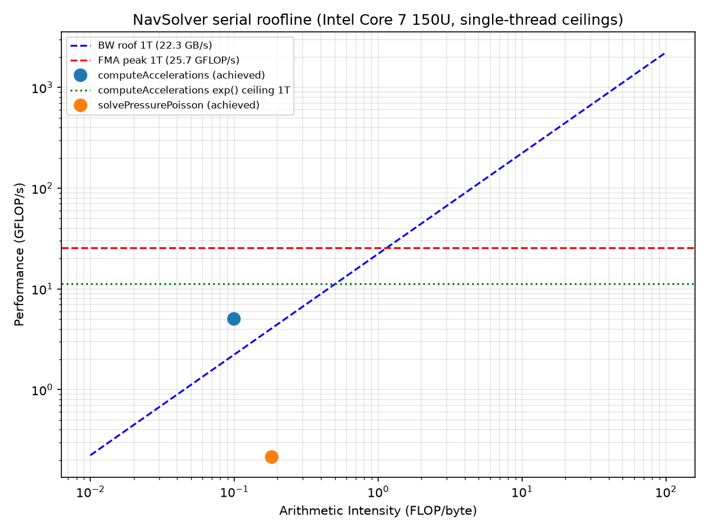

# Roofline analysis: is the serial code compute-bound or memory-bound?

**Date:** 2026-08-07
**Builds on:** `docs/serial-optimization.md`
**Machine:** Intel Core 7 150U, 6 cores/12 threads, single socket/NUMA node,
AVX2+FMA, L1d 288 KiB (48 KiB/core), L2 7.5 MiB (1.25 MiB/core), L3 12 MiB.

## Why this exists

`docs/serial-optimization.md` identified a likely-large remaining
optimization (the X/Y-direction sweeps in `computeAccelerations` don't
match `GridField`'s memory layout) but explicitly left it unfixed pending
evidence that it's actually worth the risk — a layout fix only helps if the
kernel is memory-bound; if it's compute-bound, parallelism (not layout)
is the right next lever. This analysis answers that question with
measurements instead of intuition.

## Methodology

Hardware performance counters (`perf`, LIKWID, PAPI) are not reliably
usable under this WSL2 sandbox — confirmed earlier in this project (`perf`
binary present but missing the matching kernel package; WSL2's Hyper-V
layer typically doesn't expose real PMU access to the guest). This is the
documented analytical/empirical fallback for that situation, not the
industry-standard automated path (Intel Advisor / LIKWID) — see the
"industry standard" discussion earlier in this project's history for that
distinction. Three pieces, each independently reproducible:

1. **Peak ceilings, measured empirically on this machine** (not vendor
   spec sheets) via `scripts/roofline/*.cpp`, compiled with the project's
   own Release flags (`-O3 -march=native -funroll-loops`).
2. **Analytical FLOP/byte/exp-call counts**, hand-derived from
   `src/backends/serial/Physics.cpp`, transcribed as constants at the top of
   `scripts/roofline.py`.
3. **Achieved performance**: a clean `-O3` Release build's total wall-clock
   time (never the `-pg` build — confirmed in the prior serial-optimization
   pass that its per-call instrumentation overhead distorts absolute
   timing) apportioned by a `-pg`/`gprof` profile's *relative* self-time
   breakdown, on the same baseline workload as `docs/serial-optimization.md`
   (`AbruptExpansion`, 96×48×24, 100 steps, `SteadyMarching`).

Run via `python3 scripts/roofline.py` (needs `matplotlib` in `.venv`, added
this session — `benchmark.py`/`validate.py` stay stdlib-only).

## Peak ceilings measured on this machine

| Ceiling | 1 thread | 12 threads (best of 3) |
|---|---|---|
| FMA GFLOP/s | 25.7 | 255.4 |
| Memory bandwidth (STREAM-triad) | 22.3 GB/s | 34.0 GB/s |
| `std::exp()` throughput | 2.86×10⁸ calls/s | 1.26×10⁹ calls/s |

Vectorization confirmed for the FMA microbenchmark (not just assumed from
the flag): `-fopt-info-vec-optimized` reports "loop vectorized using 32
byte vectors" (AVX2, 256-bit) and the compiled binary contains 32 `vfmadd`
instructions.

**Notable finding, not part of the original ask but relevant to Phase 3
(OpenMP) planning**: memory bandwidth saturates almost immediately —
2 threads (33.8 GB/s) is nearly indistinguishable from 12 threads
(29.6-43.0 GB/s across repeated runs, noisy but flat, no clear upward
trend past ~2 threads). If a kernel turns out memory-bandwidth-bound,
**OpenMP thread count won't help it much on this specific machine** —
worth remembering when interpreting Phase 3's scaling curves; a
memory-bound kernel scaling poorly with threads here would confirm this,
not indicate a bug in the parallelization.

## Analytical per-cell counts (hand-derived from `src/backends/serial/Physics.cpp`)

**`computeAccelerations`** (summed across all 3 direction sweeps, treated
as structurally equal cost — X/Y/Z differ only in which velocity component
leads and which neighbor offsets are used, not in operation count):

- ~79 FLOPs/cell/sweep × 3 sweeps = **237 FLOPs/cell**
- 2 `std::exp()` calls/cell/sweep (inside `computeExponentialWeights`,
  called twice per sweep — once for face coefficients, once for the
  cross-term correction) × 3 sweeps = **6 exp() calls/cell**
- **~2400 bytes/cell**, conservative estimate: every distinct field-array
  element access (`velX`/`velY`/`velZ`/`accelX`/`accelY`/`accelZ`), in
  every separate pass, counted as one fresh 8-byte DRAM transaction — i.e.
  assuming **no** reuse across the 5 sequential passes per plane. Flagged
  explicitly as likely too conservative — see Results below, where the
  measurement itself falsifies this assumption.

Cross-check: 6 exp() calls/cell × 105,984 active cells × 100 steps =
63.6M — matches the ~60.3M `computeExponentialWeights`-adjacent calls
measured in `docs/serial-optimization.md`'s baseline profile closely
enough (same order, same workload family) to trust the per-cell counting
methodology.

**`solvePressurePoisson`**, per interior cell:
- **13 FLOPs** (10 for the 7-point stencil update + 3 for the SOR blend)
- **72 bytes**, same no-reuse-assumed methodology (7 neighbor+source reads
  + 1 self-read for the SOR blend + 1 write, no cross-cell reuse assumed)

## Results

| Kernel | Arithmetic Intensity | Achieved | vs. FMA peak (25.7) | vs. bandwidth-implied ceiling at this AI |
|---|---|---|---|---|
| `computeAccelerations` | 0.099 FLOP/byte | 5.06 GFLOP/s | 20% | **139%** — exceeds it |
| `solvePressurePoisson` | 0.181 FLOP/byte | 0.22 GFLOP/s | 0.8% | 5% |



## Honest methodological finding: the conservative byte-count isn't a tight bound

`computeAccelerations`'s achieved throughput (5.06 GFLOP/s) sits *above*
the bandwidth ceiling implied by its own analytically-derived arithmetic
intensity (2.20 GFLOP/s) — visible in the plot as the blue dot sitting
above the dashed bandwidth roof line at its x-position. That's not
physically possible for a true DRAM-bandwidth ceiling; it means the
"no-reuse-across-passes" byte-counting assumption is measurably too
conservative. The working set touched per `(j,k)` plane in one pass
(roughly one cache line's worth of values across the swept dimension) is
small enough to plausibly stay resident in L1/L2 across the 5 passes,
so real DRAM traffic is lower — and real arithmetic intensity higher —
than the naive count assumes. **Reported plainly rather than adjusting the
constant after the fact to make the plot look consistent**: the specific
"X GB/s away from the DRAM roof" framing shouldn't be trusted at face
value for this kernel. What *does* still hold regardless of exactly which
byte-count is right: achieved throughput (5.06 GFLOP/s) is well below both
the FMA peak (25.7, ~20%) and the `computeAccelerations`-specific
exp()-throughput ceiling (11.3 GFLOP/s-equivalent, ~45%) — so there is real
headroom being lost to *something* beyond the exp() calls themselves,
consistent with (though this analysis alone doesn't prove) the
non-unit-stride access pattern identified in `docs/serial-optimization.md`.

`solvePressurePoisson` has no such anomaly — achieved (0.22 GFLOP/s) sits
cleanly *below* both its bandwidth-implied ceiling (4.03 GFLOP/s, achieving
only ~5% of it) and the FMA peak (~0.8%). This is a much larger, more
reliable gap than `computeAccelerations`'s, and the likely explanation
isn't primarily memory bandwidth at all: Gauss-Seidel/SOR's per-cell update
reads a neighbor that was *just written* in the same sweep — a genuine
read-after-write dependency on every iteration that limits instruction-
level parallelism regardless of how fast memory is. Its `j`-innermost loop
(sweep order `for(i) for(k) for(j)`) also doesn't match `GridField`'s
`k`-fastest-varying storage, compounding the effect, but the RAW-hazard
story is likely dominant given how far below even the generous ceiling it
sits.

## Verdict

**`computeAccelerations`: proceed with the Phase 2 loop-order
restructuring.** The low arithmetic intensity and the ~20%-of-FMA-peak /
~45%-of-exp-ceiling achieved performance both point the same direction —
real headroom, likely a memory/cache-access-pattern problem — even though
the specific DRAM-bandwidth-ceiling number shouldn't be over-trusted given
the finding above. This is evidence *for* proceeding, not proof of the
exact mechanism; the golden-field regression test specified in the
approved plan is what actually validates the fix, not this analysis alone.

**`solvePressurePoisson`: the red-black restructuring already planned for
Phase 3 is doing double duty.** It wasn't scoped as a serial speedup — it
was scoped as an OpenMP/CUDA correctness prerequisite (Gauss-Seidel's
sequential dependency can't be parallelized as-is). This analysis adds a
second, independent reason to want it: breaking that same dependency chain
(processing color-independent cells that don't depend on each other) is
also very likely to improve *serial* instruction-level parallelism, given
how far below even a generous ceiling the current implementation sits.
Worth measuring serial wall-clock before/after the red-black change lands,
not just correctness — a plausible free serial win alongside the
parallelization work.

## Reproducing this

```bash
source .venv/bin/activate   # matplotlib
python3 scripts/roofline.py
# writes experiments/results/roofline/roofline_summary.csv,
#        experiments/results/roofline/gprof_raw.txt,
#        experiments/figures/roofline.png
```

---

## Correction, 2026-08-28: it is neither the exp() nor the memory

Everything above reads `computeAccelerations` as sitting at ~45% of an
exp() throughput ceiling with an arithmetic intensity of 0.099 FLOP/byte,
and concludes "likely a memory/cache-access-pattern problem". Both halves
of that are wrong, and the conclusion sent one iteration down a dead end
before the cost was measured directly instead of modelled.

Method: build a diagnostic variant from the same commit with one construct
replaced by a same-shape stand-in (results deliberately wrong, never
committed), then time `kbench --kernel computeAccelerations` against the
real binary, interleaved, at both Reynolds numbers the project uses --
kbench defaults to Re=10000, while the roofline and reward workloads use
Re=100, and the branch taken inside `computeExponentialWeights` differs
between them.

| construct removed | Re=10000 | Re=100 |
|---|---|---|
| `exp()` -> polynomial stand-in | 1.6-3.0% | 6.7-7.1% |
| all divisions -> multiplications | 29.4-30.7% | 28.9-29.2% |
| ...of which the two `/localRe` | 15.3% | 14.6% |
| ...of which `pip`'s own (poly + exp branch) | 20.4% | 18.9% |
| ...of which `computeQsi`'s | 10.5% | 10.6% |

(The three sub-rows do not sum to the combined row; removing one division
lets the others' latency overlap, so measured individually each looks
larger than its marginal share.)

**exp() is not the bottleneck.** It is at most 7% of the kernel, not the
~55% the "45% of the exp ceiling" line implies. At Re=10000, `DPe` is
around 625, the `|DPe| > 200` branch returns without calling `exp` at all,
and the kernel still costs the same. `exp_ceiling_gflops_1t` divides the
kernel's whole FLOP count by its exp count and multiplies by a
back-to-back-exp microbenchmark rate; that models a kernel whose exps
cannot overlap with anything else, which this one's plainly can. Read the
metric as a lower bound on achievable, never as an attribution.

**It is not bandwidth-bound either.** ns per active cell across a 145x
growth in working set, well past the 12 MB L3:

| grid | working set (6 fields) | accel ns/cell | pressure ns/cell |
|---|---|---|---|
| 32x16x8 | 0.3 MB | 31.70 | 16.79 |
| 96x48x24 | 5.8 MB | 33.95 | 15.08 |
| 128x64x32 | 13.4 MB | 35.17 | 14.90 |
| 192x96x48 | 43.5 MB | 37.20 | 15.94 |

17% from L2-resident to four times L3. A bandwidth-bound kernel falls off
a cliff there; this one does not, and `solvePressurePoisson` is flat.

**It is division throughput.** ~21 double divisions per cell per call (7
per sweep: 3 in pass 1's `computeExponentialWeights`, 1 in its
`computeQsi`, 3 in pass 3's), every one of them scalar because
`computeExponentialWeights`' four-way branch chain leaves the enclosing
loop unvectorised. At ~4-6 cycles of `divsd` throughput that alone is the
order of the whole measured runtime.

The three sweeps are near-equal in cost, so `roofline.py`'s "X/Y/Z treated
as structurally equal" is sound (per-sweep timers, 96x48x24, 40 calls):

| | X | Y | Z |
|---|---|---|---|
| Re=10000 | 31.6% | 32.3% | 36.1% |
| Re=100 | 35.6% | 31.3% | 33.2% |

### What follows from this

Vectorising the divisions is the available win, and it can be done
bit-identically. Every branch of `computeExponentialWeights` and
`computeQsi` can be written as a single division of a `(num, den)` pair
chosen by the branch, because `x/1.0` and `0.0/1.0` are exact:

| branch | num | den |
|---|---|---|
| `\|DPe\| < 0.1` | `1` | the polynomial |
| `\|DPe\| <= 200` | `DPe` | `exp(DPe) - 1` |
| `DPe > 200` | `0` | `1` |
| otherwise | `-DPe` | `1` |

That turns the branchy scalar evaluation into a scalar pass that only
selects operands and a division pass with no control flow in it, which is
the shape `KernelRows.hpp` already vectorises. The same restructuring
covers `pip / localRe` and `pim / localRe`, which are unconditional today
and account for ~15% on their own.

Two things measured along the way that are *not* the win:

- **Vectorising the Z sweep's stencil arithmetic is worth ~0.6%.** Passes
  2 and 3 were split so the ~40 FLOPs of differences and products moved
  into a `zDiffusionCrossRow` row kernel that does vectorise to 32-byte
  vectors. Paired, 9/9 pairs, 1.006x -- inside this kernel's 0.992-1.013x
  code-layout band, so not resolvable. Reverted. The arithmetic around the
  divisions is not what the kernel is waiting on.
- **The pressure solve is flat in ns/cell at every size**, so the red-black
  argument above should not expect a bandwidth win either; its case rests
  on the dependency chain and on parallelisation, as originally scoped.

---

## Where the two big kernels stand, 2026-09-01

After the division work (641b4e1, 48a49b5, 6bac91a) and the Gauss-Seidel
diagonal blocking (b52fd70, 140a9a9), re-measured the same way -- diagnostic
builds with one construct replaced by a same-shape stand-in, timed
interleaved against the real binary.

**`computeAccelerations`**, now ~59% of the step:

| component | share of the kernel |
|---|---|
| divisions (now vectorised) | 29-33% |
| scalar operand pass (branch chain + `exp`) | 21-26% |
| everything else (vectorised stencil, loads, stores) | ~45% |

The divisions did not shrink as a *share* -- they were 29% before being
vectorised and are 29-33% after -- because the stencil arithmetic sitting
next to them vectorised at the same time and by about the same factor. In
absolute terms both got roughly 1.25x faster together. What this says is
that the kernel is now at the `vdivpd` throughput floor: the division count
per cell is fixed by the scheme, and cutting it means changing the
arithmetic, which the gate forbids. There is no further win here without
relaxing that.

The scalar operand pass is the branch chain and the transcendental, both
of which the physics requires. Note it is ~22% while `exp` alone is <=7%:
most of that cost is the branching and the stores, not the transcendental.
A row-level dispatch could vectorise it when every cell in a row takes the
same branch -- at Re=10000 all of them take `DPe > 200`, which needs no
`exp` at all -- but that buys nothing at Re=100, which is what the reward
and roofline workloads actually run.

**`solvePressurePoisson`**, now ~19% of the step, down from ~26%:

| | recurrence share |
|---|---|
| before diagonal blocking | 69-75% |
| after, six rows per block | 24-31% |

Most of the dependent-latency stall is gone. What remains is the ragged
prologue and epilogue of each skewed block, the k=1 and k=nZ phases (which
are themselves six-cell dependent chains along j, and cannot be broken in
lexicographic order), and the boundary rows that keep the general path.
Recovering it would need a different structure -- interleaving one block's
k=nZ phase with the next block's k=1 phase is legal and would give two
chains there -- for perhaps 4-5% of the whole program.

### Measurement note: OpenMP at six threads still cannot be read here

The accel work measures 1.143x whole-program at one thread, 7/7 pairs. The
same binaries at six threads gave 0.948x with 0/7 pairs in one window and
0.974x with 5/11 in another, with individual pairs ranging 0.860-1.105 --
and bisecting the interval put *both* halves above 1.0x, which cannot be
true if the whole is below it. Treat any six-thread whole-program number
from this machine as unresolvable rather than as a verdict, exactly as the
kernel tier already is.
